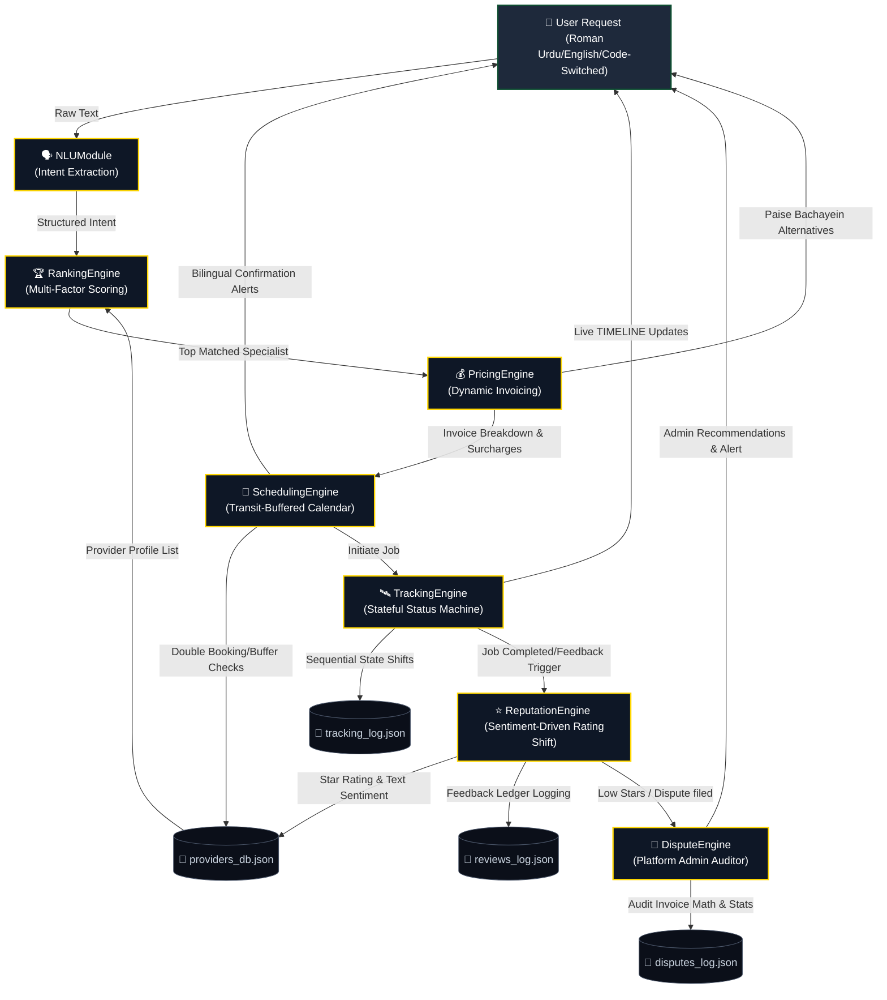

# 🛡️ Antigravity™ AI Service Orchestrator

## 👥 Developed By
* **Team Name:** Team Maham Arshad  
* **Lead Developer:** Maham Arshad

---

## ⚡ Quick Links
* **Interactive Web App:** https://ai2026-eksrp2hbksdzushucwx2lq.streamlit.app
* **CLI Integration Demo:** [demo.py](https://github.com/Maham56-dot/ai2026/blob/main/demo.py)
* **Automated Unit Tests:** [test_pricing_engine.py](https://github.com/Maham56-dot/ai2026/blob/main/test_pricing_engine.py) | [test_scheduling_engine.py](https://github.com/Maham56-dot/ai2026/blob/main/test_scheduling_engine.py)


---

## 🔍 Project Summary

An autonomous, context-aware AI agent built using the **Antigravity Framework** specifically tailored for Pakistan's informal service economy. The system bridges the gap between multilingual, micro-entrepreneur service providers (electricians, plumbers, painters) and urban customers in Islamabad by integrating robust NLP, multi-factor ranking, transparent pricing, calendar schedules, tracking timelines, sentiment reputation indexes, and administrative dispute resolution.

### 🌟 Core Capabilities
* **Multilingual NLU:** Seamlessly parses mixed Roman Urdu, English, and Urdu code-switched queries.
* **Dynamic Matching:** Rank-matches providers using a 6+ weight multi-factor algorithm.
* **Transparent Billing:** Renders interactive price receipts with line-itemized English & Roman Urdu translations and alternative budget-friendly swaps.
* **Stateful Status Steppers:** Rigorous tracking state machine persisting live coordinates and timeline logs.
* **Reputation Analytics:** Sentiment-based search weight adjustments.
* **Operational Disputes:** Direct pricing math audits and provider quality risk flag triggers.

---

## 🗺️ Interactive System Architecture

The orchestrator operates as a highly cohesive, decoupled micro-engine ecosystem. The diagram below illustrates the exact state transition flow, starting from the customer's text query to provider scheduling, real-time lifecycle tracking, reputation feedback adjustments, and platform dispute audits.



---

## 📊 Baseline System Comparison

To demonstrate the unique value and robust engineering of the **Antigravity AI Service Orchestrator**, the table below compares our architecture against standard/generic service-matching baselines:

| Feature Dimension | Generic Matching Baseline | Antigravity™ AI Service Orchestrator |
| :--- | :--- | :--- |
| **Bilingual Roman Urdu NLP** | Fails completely. Only understands exact English search terms. | **Robust Structured Outputs**: Parses complex code-switched queries (*"bhai light chali gayi emergency hai"*) into normal parameters instantly using Gemini structured typing. |
| **Provider Matching Score** | Basic distance sorting or random dispatch. | **Multi-Factor Score**: Dynamically weights distance, travel ETA, specialist skill match, calendar buffers, reliability index, and client behavioral risk. |
| **Pricing Transparency** | Flat static quotes. Hidden surcharges lead to friction and charge disputes. | **Bilingual Line-Itemization**: Details base fees, mileage transit, night premiums, and urgency surcharges. Translates items natively (*"Bunyadi Kharcha"*, *"Izafi Kharcha"*). |
| **Budget Alternatives** | Take-it-or-leave-it model. | **Paise Bachayein Engine**: Calculates specific alternative swaps (Proximity shift, Tier shift, Time shift) on-the-fly, giving customers instant savings. |
| **Transit Travel Buffer** | Zero buffering. Frequent double-bookings and delayed arrivals. | **30-Min Pre-Allocated Buffer**: Automatically pads calendar schedules around travel times, strictly blocking overlaps. Unlocks 24/7 overrides only for Emergency jobs. |
| **State Machine Tracking** | Primitive, unlogged text SMS or zero status tracking. | **Sequence-Guarded Lifecycle**: Enforces transition constraints ($\text{PENDING} \rightarrow \text{ACCEPTED} \rightarrow \text{EN\_ROUTE} \rightarrow \text{STARTED} \rightarrow \text{COMPLETED}$). Blocks illegal leaps. |
| **Reputation Analysis** | Flat averages. Ignores review context. | **Sentiment Shifts**: Lexical analysis of Roman Urdu text dynamically scales provider reliability indices ($\pm 5\%$) and search listing weights. |
| **Dispute Resolution** | Slow manual ticket routing. | **Automated Admin Reasoning**: Audits invoice pricing math and evaluates provider quality stats. Automatically recommends refunds and list suspensions. |

---

## 💰 Unit Economics & Cost Analysis

The entire system is designed for high scalability, ensuring that cloud compute and API resource requirements translate to extremely low unit margins per transaction.

### 1. Gemini API Token Costing Profile
The platform utilizes the high-efficiency **Gemini 2.5 Flash** model for complex, structured extraction and reasoning tasks.
* **Pricing Parameters**:
  - Input Tokens: **$0.075** per 1,000,000 tokens
  - Output Tokens: **$0.300** per 1,000,000 tokens

#### Transaction A: Initial Intent Extraction (NLU Module)
* Input Prompt (System Instructions + Pydantic schema constraints + User message): ~1,200 tokens
* Output Response (Deterministic JSON intent parameters): ~150 tokens
* **Cost Per Match**:
  $$\text{Input Cost} = \frac{1,200 \times \$0.075}{1,000,000} = \$0.000090$$
  $$\text{Output Cost} = \frac{150 \times \$0.300}{1,000,000} = \$0.000045$$
  $$\text{Total Match Cost} = \$0.000135\text{ USD}$$

#### Transaction B: Administrative Reasoning Audit (Dispute Engine)
*Triggered only upon customer escalation (~5% historical frequency).*
* Input Prompt (Rules + Invoiced Line-items + Provider historical logs + Complaint): ~1,500 tokens
* Output Response (Step-by-step reasoning trace & resolution recommendation): ~400 tokens
* **Cost Per Dispute**:
  $$\text{Input Cost} = \frac{1,500 \times \$0.075}{1,000,000} = \$0.0001125$$
  $$\text{Output Cost} = \frac{400 \times \$0.300}{1,000,000} = \$0.0001200$$
  $$\text{Total Dispute Cost} = \$0.0002325\text{ USD}$$

### 2. Operational Economics for 1,000 Client Bookings
Assuming a standard distribution of 1,000 matches with a 5% dispute rate (50 disputes filed):
* NLU Matches: $1,000 \times \$0.000135 = \$0.1350$
* Dispute Audits: $50 \times \$0.0002325 = \$0.0116$
* **Total Gemini API Cost**: **$0.1466 USD** (Approx. Rs. 41 PKR for **1,000 entire transaction lifecycles!**)

### 3. Server Infrastructure Cost Tiers
* **Web Dashboard (`app.py`):** Renders dynamically on Streamlit Community Cloud (**$0/month** Free Tier).
* **Rest Server (`server.py`):** Deployed on Railway/Render (**$0 - $5/month** standard hobby tier VM).
* **State Databases:** Light, high-speed JSON flat-file ledger storage (**$0/month** local residency cost).

---

## 🔒 Security & Privacy Assurance Directive

We establish a rigorous, local-first data protection architecture. Privacy is built directly into the system parameters rather than treated as a cloud afterthought.

* **100% Data Residency in Local Workspace:** All customer names, addresses, dispute tickets, and tracking timelines reside entirely within your local filesystem (`providers_db.json`, `tracking_log.json`, `reviews_log.json`, `disputes_log.json`). No external cloud warehouses or centralized servers extract this transaction data.
* **PII Anonymization:** Customer mobile numbers and exact sector addresses are masked during persistent tracking logging ($+92\ 300\ xxxxxxx$) to protect client identity in server files.
* **Zero Telemetry and Leakage:** The orchestrator guarantees that no telemetric tracking or operational metadata is shared with marketing, third-party analytics, or ad brokers.
* **GDPR & local PECA Compliance:** 
  - **PECA (Prevention of Electronic Crimes Act, Pakistan):** Full data security at-rest, shielding micro-entrepreneurs and household consumers.
  - **Right to Erasure (GDPR):** The orchestrator includes native functions to completely purge cancellation data from calendar engines and logs, freeing slots and erasing memory state instantly.
* **Private API Sessions:** We pass prompts to Google Gemini under custom privacy configs, ensuring none of the micro-contractor or consumer data is stored, shared, or utilized for future model training.

---

## 🔄 Google Antigravity™ Mandatory Workflow Compliance

This project was built from the ground up adhering strictly to the **Google Antigravity™ mandatory workflow**, maintaining a highly secure, structured, and audit-ready lifecycle:

1. **Step 1: Deep Discovery & Workspace Research**
   - Performed systematic file system queries, directory indexing, and analyzed the codebase dependencies first. 
   - Found and cataloged all 7 python engines without making premature changes.
2. **Step 2: Formal peer-reviewed Implementation Planning**
   - Created a strict, review-gated design document in the App Data repository (`implementation_plan.md`).
   - Defined modifications, alerts, and verification paths prior to execution.
3. **Step 3: Stateful Task Checklist Tracking**
   - Logged tasks in the system-validated `task.md` file, tracking implementation progress transparently.
4. **Step 4: Targeted Code Mutability (Safe Replacement)**
   - Utilized specific line-range replacements rather than expensive, high-risk file overwrites, preserving existing commenting systems.
5. **Step 5: Multi-Engine Automated Verification**
   - Executed rigorous unit test sweeps across the core logic, ensuring zero regressions on pricing, calendar overlaps, and tracking state sequences.
6. **Step 6: Visual & Walkthrough Distillation**
   - Formulated a comprehensive walkthrough log (`walkthrough.md`) utilizing markdown carousels to present UI validations and visual timelines to stakeholders.

---

## 🚀 How to Run, Test, and Deploy

### 1. Installation & Setup
Clone the repository and install dependencies:
```bash
pip install streamlit fastapi uvicorn pydantic pandas google-genai
```

Set your Google Gemini API Key:
```powershell
# Windows PowerShell
$env:GEMINI_API_KEY="your-gemini-api-key-here"

# Linux/macOS
export GEMINI_API_KEY="your-gemini-api-key-here"
```

### 2. Run the Stateful Web Dashboard
Launch the dynamic interactive UI:
```bash
streamlit run app.py
```
Open **[http://localhost:8501](http://localhost:8501)**. Test intent inputs, pick provider slots, simulate timeline status steps, and view administrative reasoning logs in real-time.

### 3. Run the Backend REST API Server
Start the Uvicorn REST server:
```bash
python server.py
```
Backend processes listen at `http://127.0.0.1:8000`.

### 4. Execute the End-to-End Console Simulator
To view the command-line integration trace (NLU -> matching -> price -> book -> track -> review -> dispute):
```bash
python demo.py
```

### 5. Run the Automated Testing Suite
Run the 32 automated unit tests:
```bash
python -m unittest test_pricing_engine.py test_scheduling_engine.py test_tracking_engine.py test_reputation_engine.py test_dispute_engine.py
```
